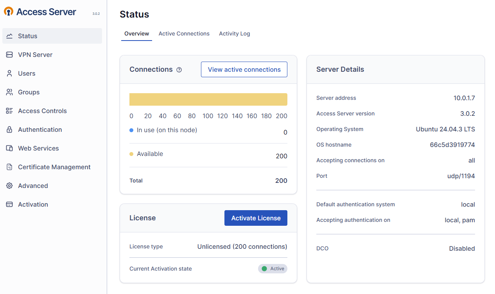
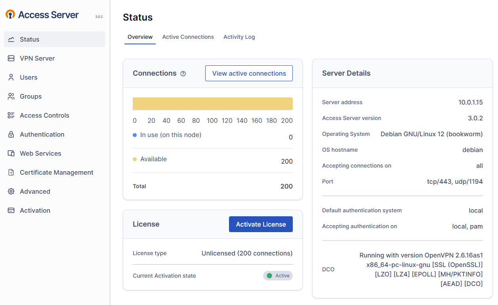

# OpenVPN Access Server Patch Utility

A Python utility to patch OpenVPN Access Server (AS) by modifying the `pyovpn-*.egg` file,
increasing the concurrent VPN connection limit to **200**.

> [!WARNING]
> **Legal Notice:** Modifying OpenVPN-AS may violate its License Agreement.
> Use this utility for educational or testing purposes only.
> Always back up your configuration before applying patches.

---

## 🛠 Tested Environments

The utility has been verified to work on the following versions:

* **OpenVPN-AS 2.14.3** (Docker)
* **OpenVPN-AS 3.0.2** (Docker & Bare Metal Service)

### Proof of Concept




---

## 🚀 Usage Instructions

### Download the Script

```bash
wget -O ovpn.py https://raw.githubusercontent.com/AyzinA/OpenVPN-AS-Patch/master/ovpn.py

```
or
```bash
curl -o ovpn.py https://raw.githubusercontent.com/AyzinA/OpenVPN-AS-Patch/master/ovpn.py

```

### Option 1: Using Docker (Recommended)

1. **Transfer the script** to the container:
```bash
docker cp ovpn.py openvpn-as:/tmp/ovpn.py

```


2. **Install dependencies and run** (specifically for AS 3.0+):
```bash
docker exec -it openvpn-as bash -c "
  apt-get update && \
  apt-get install -y python3-pip && \
  pip3 install colorama --break-system-packages && \
  python3 /tmp/ovpn.py
"

```


*Select `1` to apply the patch or `q` to exit.*
3. **Restart the service**:
```bash
docker restart openvpn-as

```


---

### Option 2: Bare Metal / Standard Service

1. **Download/Save** the script as `ovpn.py` on your host.
2. **Install dependencies and run** (as root):
```bash
sudo apt update && sudo apt-get install -y python3-pip
sudo pip3 install colorama --break-system-packages
sudo python3 ovpn.py

```


*Select `1` to apply the patch.*
3. **Restart OpenVPN-AS**:
```bash
sudo systemctl restart openvpnas

```


---

## 📂 Docker Compose Deployment

If you are starting from scratch, you can use this `docker-compose.yml` to deploy a compatible version:

```yaml
services:
  openvpn-as:
    image: openvpn/openvpn-as:3.0.2-87c70987-Ubuntu24
    container_name: openvpn-as
    restart: unless-stopped
    ports:
      - "1194:1194/udp" # VPN Traffic
      - "943:943"       # Admin UI
      - "443:443"       # Client Web Server
    volumes:
      - ./openvpn-data:/openvpn
    cap_add:
      - MKNOD
      - NET_ADMIN
    devices:
      - /dev/net/tun

```

---

## 🛡 Disclaimer

This project is provided "as is" without warranty of any kind. The authors are not responsible for any misuse or damage caused by this script.
